# AI Health Analyzer Design Document

## Overview

The AI Health Analyzer is a full-stack web application built using the MERN stack (MongoDB, Express.js, React.js, Node.js) that provides intelligent analysis of patient health reports. The system integrates with AI services to interpret medical documents and present findings in user-friendly formats.

## Architecture

### Complete System Design Flow

#### 1. High-Level System Architecture

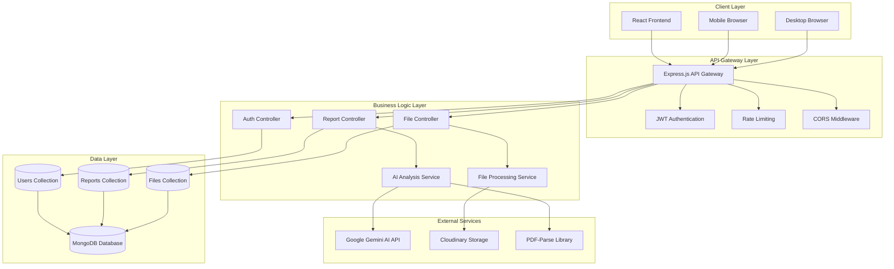

#### 2. Complete User Flow Diagram

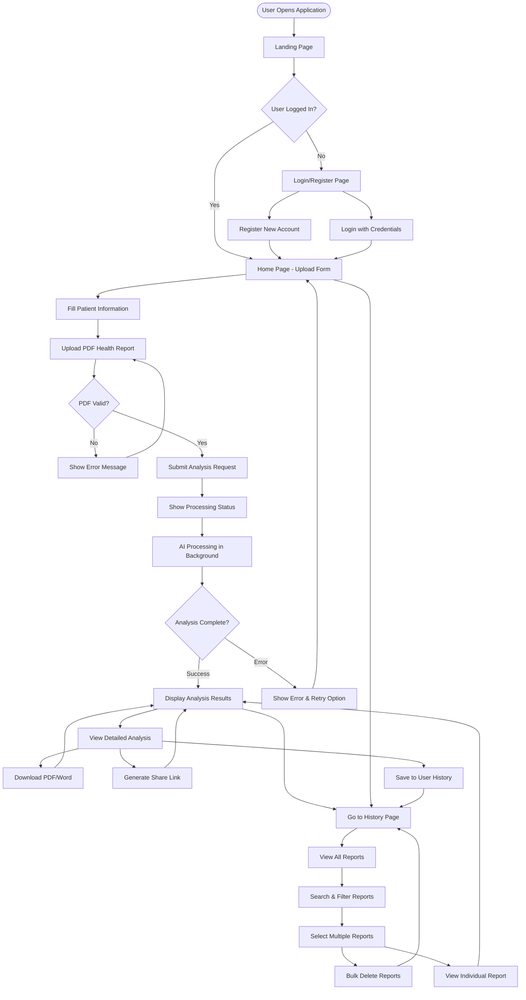

#### 3. AI Health Analyzer Processing Flow

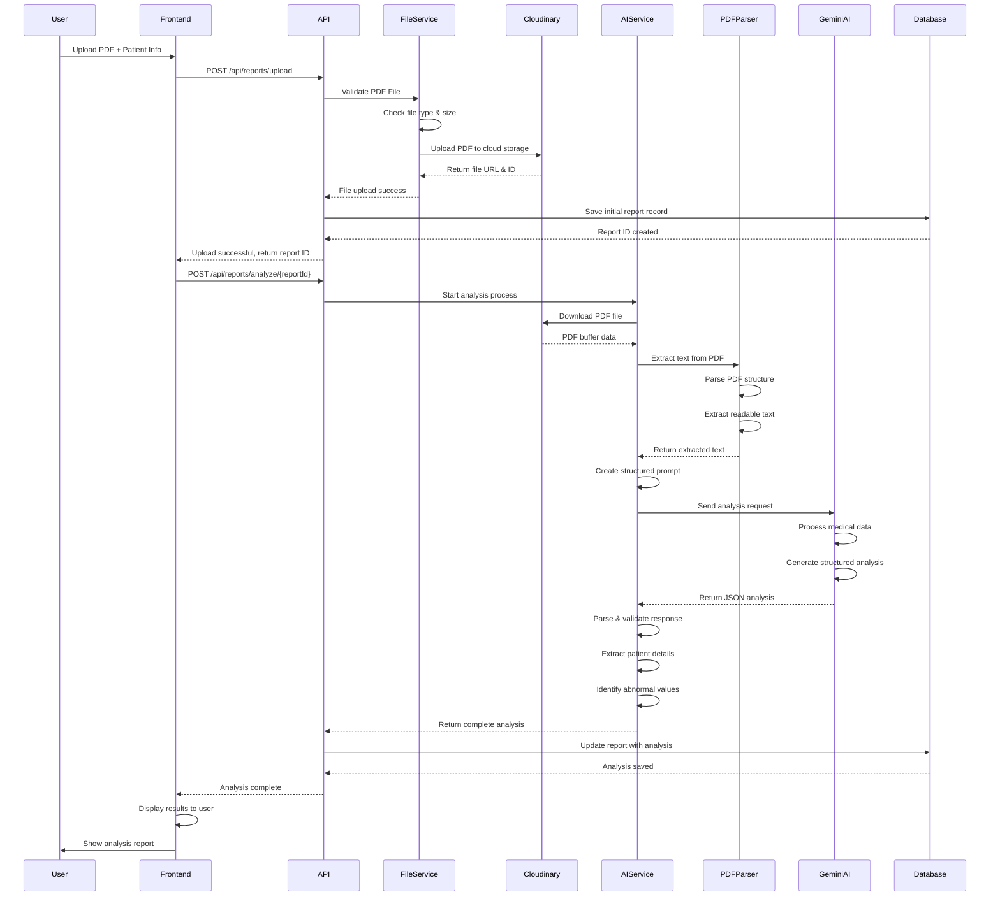

#### 4. Database Flow and Data Relationships

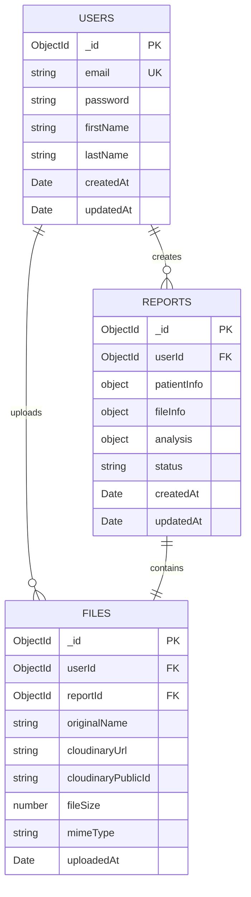

#### 5. Detailed Database Operations Flow

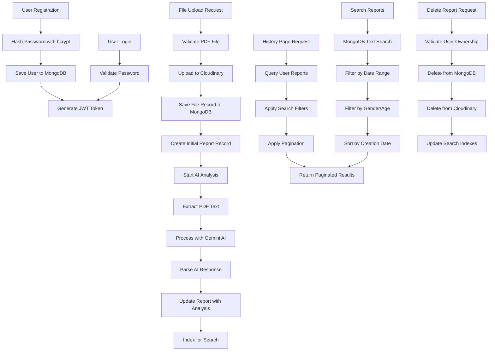

#### 6. Error Handling and Fallback Flow

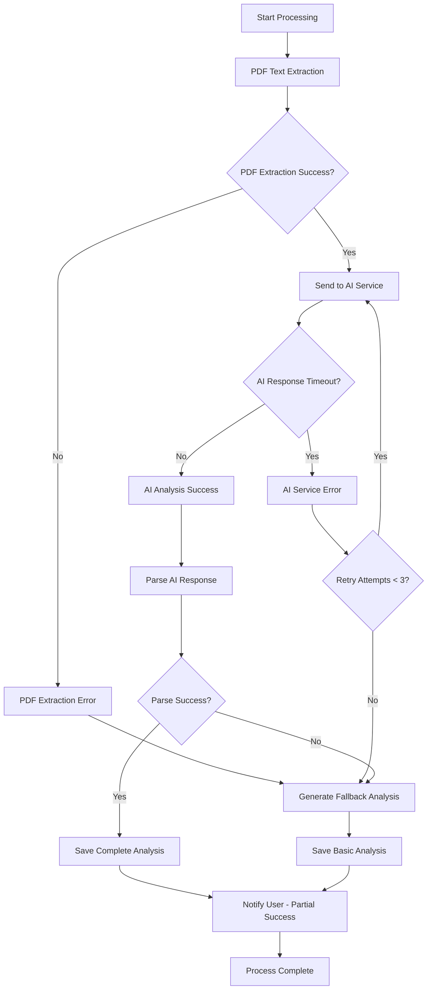

#### 7. Security and Authentication Flow

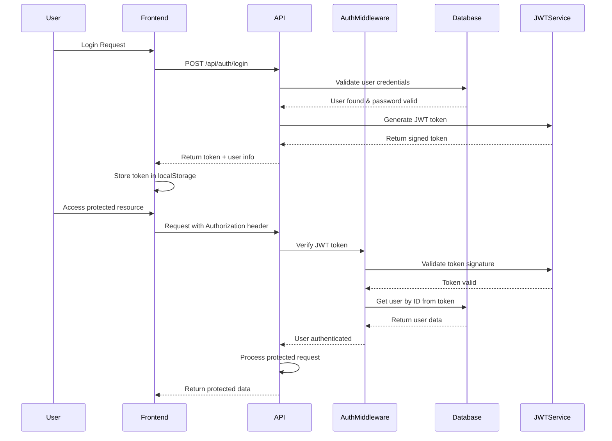

### Technology Stack

- **Frontend**: React.js 18+ with TypeScript, Tailwind CSS, React Router
- **Backend**: Node.js with Express.js, TypeScript
- **Database**: MongoDB with Mongoose ODM
- **File Storage**: Cloudinary for PDF storage and management
- **AI Integration**: Google Gemini API for document analysis
- **Authentication**: JWT tokens with bcrypt for password hashing
- **File Processing**: Multer for file uploads, PDF-parse for text extraction

#### 8. File Processing and Storage Flow

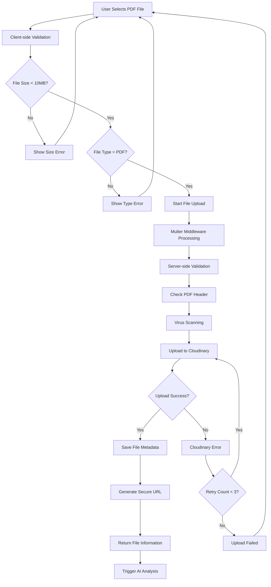

#### 9. Real-time Processing Status Flow

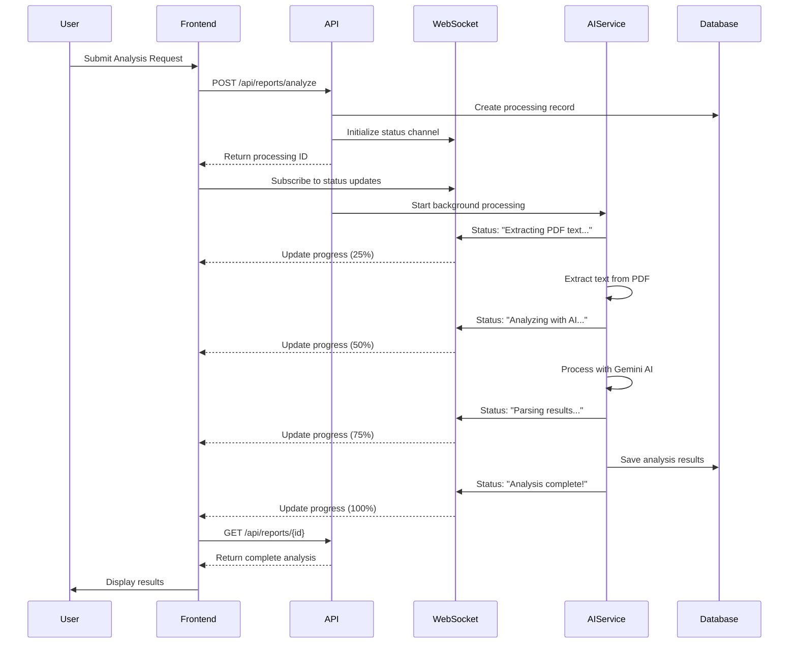

#### 10. Search and Filter System Flow

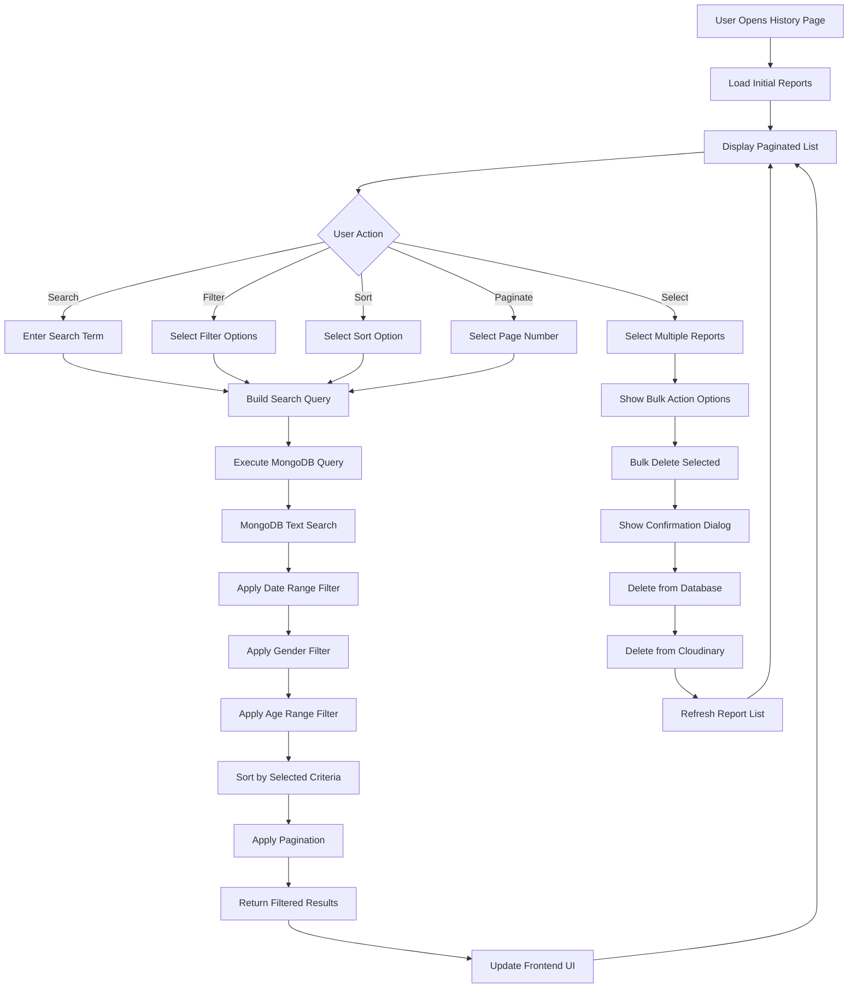

## Components and Interfaces

### Frontend Components

#### 1. Layout Components
- **Header Component**: Navigation bar with logo and menu items
- **Footer Component**: Consistent footer across all pages
- **Layout Wrapper**: Common layout structure for all pages

#### 2. Page Components
- **HomePage**: Main landing page with upload form
- **ReportPage**: Displays AI analysis results with download options
- **HistoryPage**: Lists previous reports with search and filter capabilities

#### 3. Feature Components
- **FileUpload**: Drag-and-drop PDF upload with validation
- **PatientForm**: Form for patient demographic information
- **ReportViewer**: Displays formatted AI analysis results
- **ReportList**: Paginated list of historical reports
- **SearchFilter**: Search and filter controls for report history

### Backend API Endpoints

#### Authentication Routes
```
POST /api/auth/register - User registration
POST /api/auth/login - User authentication
GET /api/auth/profile - Get user profile
```

#### Report Routes
```
POST /api/reports/upload - Upload health report file
POST /api/reports/analyze - Generate AI analysis
GET /api/reports/:id - Get specific report
GET /api/reports/user/:userId - Get user's report history
DELETE /api/reports/:id - Delete report
POST /api/reports/:id/download - Generate downloadable report
POST /api/reports/:id/share - Generate shareable link
```

#### File Routes
```
POST /api/files/upload - Upload file to Cloudinary
GET /api/files/:id - Get file metadata
DELETE /api/files/:id - Delete file from storage
```

### AI Service Integration

#### Gemini API Integration
```typescript
interface AIAnalysisRequest {
  fileContent: string;
  patientInfo: PatientInfo;
}

interface AIAnalysisResponse {
  summary: string;
  simpleExplanation: string;
  abnormalValues: AbnormalValue[];
  detectedDiseases: string[];
  possibleCauses: string[];
  symptoms: string[];
  lifestyleRecommendations: string[];
  medicineRecommendations: string[];
  doctorRecommendations: string[];
}
```

## Data Models

### User Model
```typescript
interface User {
  _id: ObjectId;
  email: string;
  password: string; // hashed
  firstName: string;
  lastName: string;
  createdAt: Date;
  updatedAt: Date;
}
```

### Report Model
```typescript
interface Report {
  _id: ObjectId;
  userId: ObjectId;
  patientInfo: {
    name: string;
    age: number;
    gender: 'male' | 'female' | 'other';
    phoneNumber: string;
  };
  fileInfo: {
    originalName: string;
    cloudinaryUrl: string;
    cloudinaryPublicId: string;
    fileSize: number;
  };
  analysis: {
    summary: string;
    simpleExplanation: string;
    abnormalValues: AbnormalValue[];
    detectedDiseases: string[];
    possibleCauses: string[];
    symptoms: string[];
    lifestyleRecommendations: string[];
    medicineRecommendations: string[];
    doctorRecommendations: string[];
  };
  status: 'pending' | 'completed' | 'failed';
  createdAt: Date;
  updatedAt: Date;
}

interface AbnormalValue {
  parameter: string;
  value: string;
  normalRange: string;
  severity: 'low' | 'high' | 'critical';
}
```

### File Model
```typescript
interface FileRecord {
  _id: ObjectId;
  userId: ObjectId;
  reportId: ObjectId;
  originalName: string;
  cloudinaryUrl: string;
  cloudinaryPublicId: string;
  fileSize: number;
  mimeType: string;
  uploadedAt: Date;
}
```

## Error Handling

### Frontend Error Handling
- **Network Errors**: Display user-friendly messages for connection issues
- **Validation Errors**: Real-time form validation with clear error messages
- **File Upload Errors**: Specific messages for file type, size, and format issues
- **AI Processing Errors**: Informative messages when analysis fails

### Backend Error Handling
- **Input Validation**: Joi schema validation for all API endpoints
- **File Processing Errors**: Proper error responses for invalid or corrupted files
- **AI Service Errors**: Fallback mechanisms and retry logic for AI API failures
- **Database Errors**: Graceful handling of connection and query failures

### Error Response Format
```typescript
interface ErrorResponse {
  success: false;
  error: {
    code: string;
    message: string;
    details?: any;
  };
  timestamp: string;
}
```

## Testing Strategy

### Frontend Testing
- **Unit Tests**: Jest and React Testing Library for component testing
- **Integration Tests**: Testing user workflows and API integration
- **E2E Tests**: Cypress for critical user journeys
- **Accessibility Tests**: Automated accessibility testing with axe-core

### Backend Testing
- **Unit Tests**: Jest for service and utility function testing
- **Integration Tests**: Supertest for API endpoint testing
- **Database Tests**: MongoDB Memory Server for isolated database testing
- **AI Integration Tests**: Mock AI service responses for consistent testing

### Test Coverage Goals
- Minimum 80% code coverage for critical business logic
- 100% coverage for authentication and security-related functions
- Integration tests for all API endpoints
- E2E tests for complete user workflows

## Security Considerations

### Data Protection
- **File Security**: Secure upload validation and virus scanning
- **Data Encryption**: Encrypt sensitive patient data at rest
- **Access Control**: JWT-based authentication with role-based permissions
- **HIPAA Compliance**: Implement necessary safeguards for health data

### API Security
- **Rate Limiting**: Prevent abuse with request rate limiting
- **Input Sanitization**: Validate and sanitize all user inputs
- **CORS Configuration**: Proper cross-origin resource sharing setup
- **Security Headers**: Implement security headers (helmet.js)

## Performance Optimization

### Frontend Performance
- **Code Splitting**: Lazy loading for route-based components
- **Image Optimization**: Optimized images and lazy loading
- **Caching**: Browser caching for static assets
- **Bundle Optimization**: Webpack optimization for smaller bundles

### Backend Performance
- **Database Indexing**: Proper indexing for query optimization
- **Caching**: Redis caching for frequently accessed data
- **File Processing**: Asynchronous file processing with queues
- **API Response Optimization**: Pagination and field selection

#### 11. Complete System Integration Flow

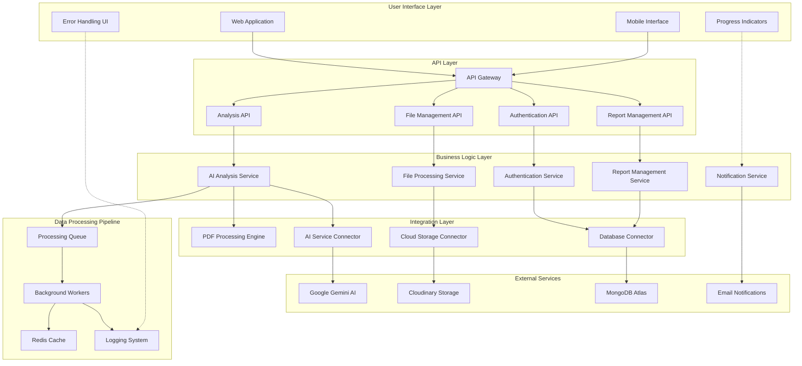

#### 12. Data Transformation and Processing Pipeline

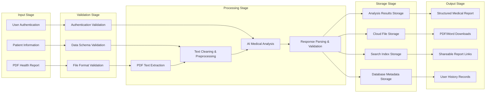

#### 13. Monitoring and Analytics Flow

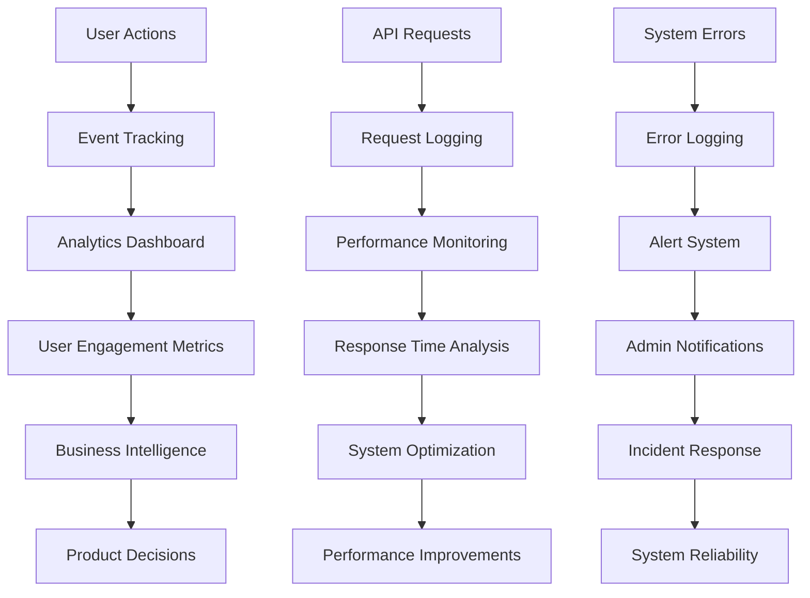

## Deployment Architecture

### Production Environment
- **Frontend**: Deployed on Vercel or Netlify with CDN
- **Backend**: Deployed on Railway, Render, or AWS EC2
- **Database**: MongoDB Atlas for managed database service
- **File Storage**: Cloudinary for reliable file storage and CDN
- **Monitoring**: Application monitoring with logging and error tracking